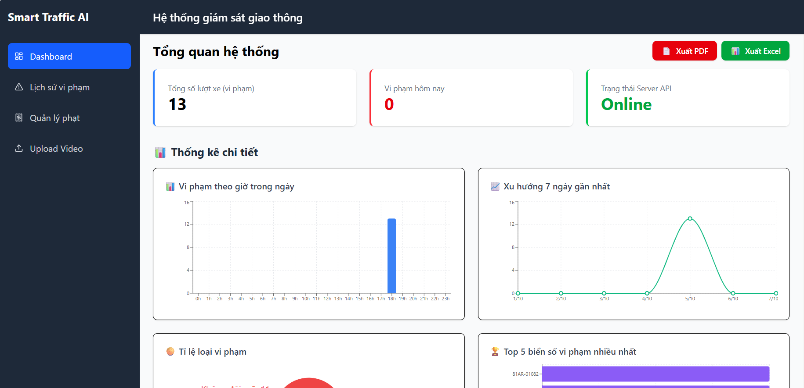
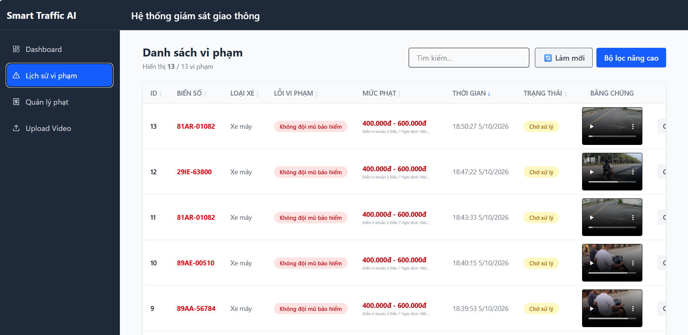

# Smart Traffic System

Hệ thống giám sát và xử lý giao thông thông minh sử dụng AI để phát hiện phương tiện, nhận diện vi phạm và cung cấp dữ liệu trực quan trên Dashboard.

## Features

- Phát hiện phương tiện bằng YOLO
- Nhận diện mũ bảo hiểm / không đội mũ
- Nhận diện xe máy chở quá số người
- Phát hiện và nhận diện biển số xe bằng OCR
- Phát hiện đèn đỏ và hành vi vượt đèn đỏ
- Nhận diện vạch kẻ dừng
- Xử lý video giao thông tự động
- Lưu hình ảnh/video bằng chứng vi phạm
- Dashboard thống kê và theo dõi vi phạm realtime
- Giao tiếp giữa các service thông qua RabbitMQ

## Screenshots

### Dashboard



### Violation Management



### Video Processing


## Architecture

```text
                    +------------------+
                    |    Frontend      |
                    | React + Vite     |
                    +--------+---------+
                             |
                             v
                    +------------------+
                    |     Backend      |
                    | Node.js/Express  |
                    +--------+---------+
                             |
              +--------------+--------------+
              |                             |
              v                             v
      +---------------+             +---------------+
      |  PostgreSQL   |             |   RabbitMQ    |
      +---------------+             +-------+-------+
                                              |
                                              v
                                   +------------------+
                                   |    AI Service    |
                                   | Python + YOLO    |
                                   | PaddleOCR        |
                                   +------------------+
```

## Tech Stack

| Component | Technology |
|---|---|
| AI | Python, YOLO, PaddleOCR, OpenCV |
| Backend | Node.js, Express.js |
| Frontend | React, Vite, Tailwind CSS |
| Database | PostgreSQL |
| Message Queue | RabbitMQ |
| Deployment | Docker Compose |

## Project Structure

```text
smart-traffic-system/
├── services/
│   ├── ai-service/
│   ├── backend-api/
│   └── frontend-dashboard/
├── infrastructure/
├── docs/
│   └── images/
├── docker-compose.yml
└── README.md
```

## Run with Docker

```bash
git clone https://github.com/Kaizeno44/smart-traffic-system.git
cd smart-traffic-system

docker compose up -d --build
```

Services:

```text
Frontend   : http://localhost:5173
Backend    : http://localhost:3000
RabbitMQ   : http://localhost:15672
PostgreSQL : localhost:5432
```

Dừng hệ thống:

```bash
docker compose down
```

## Run Development

### AI Service

```bash
cd services/ai-service
python main.py
```

### Backend

```bash
cd services/backend-api
npm install
node src/app.js
```

### Frontend

```bash
cd services/frontend-dashboard
npm install
npm run dev
```

## Processing Flow

```text
Video
  ↓
YOLO Detection
  ↓
Vehicle Tracking
  ↓
Helmet / License Plate / Traffic Light / Overload / Stop Line
  ↓
Violation Detection
  ↓
Evidence Recording
  ↓
RabbitMQ
  ↓
Backend
  ↓
Dashboard
```

## Project Goal

Xây dựng hệ thống giao thông thông minh có khả năng tự động phân tích video, phát hiện vi phạm và hỗ trợ quản lý giao thông thông qua Dashboard.

